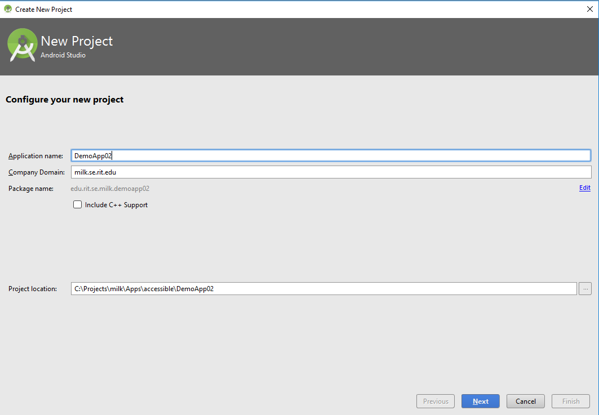

# Activity: Color Blind Safe Accessibility

### Background

This module demonstrates the importance of selecting the right colors for UI elements by utilizing colors that are color-blind safe.

A working version of this app is available at: <https://github.com/milk-modules/Apps/tree/master/accessible/DemoApp02>

Further reading: <http://mkweb.bcgsc.ca/colorblind/>

### Prerequisite

1. Android Studio is installed on the development workstation
2. A working Android emulator is available for testing

### Steps

1. Project Creation - Follow the screens below to create a new project:

   

   

   

   


2.  Create ‘Utility’ class - This class contains utility methods.

  ```java
  import android.view.View;
  import java.util.Random;


  class Utility {
      static int GenerateRandomInteger(int Min, int Max)
      {
          Random random = new Random();
          return  random.nextInt(Max - Min +1) + Min;
      }

      static float ConvertToDP(View view, int value)
      {
          return value * view.getResources().getDisplayMetrics().density;
      }
  }
  ```

3.	Create ‘CircleEventListener’ interface - This interface is used to implement event handler functionality

   ```java
   public interface CircleEventListener {
       void CirclePopped();
   }
   ```

4.  Create ‘Circle’ class - The purpose of this class is to creates and move a circle upwards on the screen. On tap of a circle it fires an event that will be handled by the main class (MainActivity)

  ```java
  import android.content.Context;
  import android.graphics.Canvas;
  import android.graphics.Color;
  import android.graphics.Paint;
  import android.graphics.Rect;
  import android.util.DisplayMetrics;
  import android.view.MotionEvent;
  import android.view.View;
  import android.view.ViewGroup;

  public class Circle extends View {
      private float x = -1;
      private float y = -1;
      private boolean isPoppable = false;

      private  float circleRadius;

      private int circleColor = Color.TRANSPARENT;
      private int textColor = Color.TRANSPARENT;

      private final Paint mPaint = new Paint(Paint.ANTI_ALIAS_FLAG);
      private CircleEventListener listener;

      @Override
      protected void onDraw(Canvas canvas) {
          //  super.onDraw(canvas);
          if(y != -1 || x != -1) {
              mPaint.setStyle(Paint.Style.FILL);
              mPaint.setColor(circleColor);

              canvas.drawCircle(x, y, circleRadius, mPaint);

              if(isPoppable) {
                  Paint paint = new Paint();
                  paint.setColor(textColor);
                  paint.setTextSize(64f);
                  paint.setAntiAlias(true);
                  paint.setTextAlign(Paint.Align.CENTER);

                  canvas.drawText("*", x, y + circleRadius / 2, paint);
              }
          }
      }

      public Circle(Context context, int fillColor, int maxWidth,  boolean poppable) {
          super(context);
          circleColor = fillColor;
          textColor = Color.BLACK;
          isPoppable = poppable;
      }

      public void setCircleEventListener (CircleEventListener listener) {
          this.listener = listener;
      }


      public void Move(){
          circleRadius = Utility.ConvertToDP(((View) this.getParent()),20);

          if(y== -1 || x==-1){
              int containerHeight = ((View) this.getParent()).getMeasuredHeight();
              int containerWidth = ((View) this.getParent()).getMeasuredWidth();

              //The initial horizontal position of the screen is random
              //The formula is to prevent the circle from being partially drawn outside the screen
              x =  Utility.GenerateRandomInteger(((int) circleRadius), containerWidth - ((int) circleRadius));

              //The initial vertical position of the circle is at the bottom of the screen
              y = containerHeight - circleRadius;
          }
          else
          {
              y = y - circleRadius*2;
          }

          invalidate();
      }


      @Override
      public boolean onTouchEvent(MotionEvent event) {
          float touchX = event.getX();
          float touchY = event.getY();
          switch (event.getAction()){
              case MotionEvent.ACTION_DOWN:
                  circleTouched(touchX,touchY);
                  break;
          }
          return super.onTouchEvent(event);
      }

      private void circleTouched(float touchX, float touchY) {
          if (Math.sqrt(Math.pow(touchX - x, 2) + Math.pow(touchY - y, 2)) < circleRadius & isPoppable) {
              circleColor = Color.TRANSPARENT;
              textColor = Color.TRANSPARENT;
              if (listener != null)
                  listener.CirclePopped();
          }
      }
  }
  ```

  ​