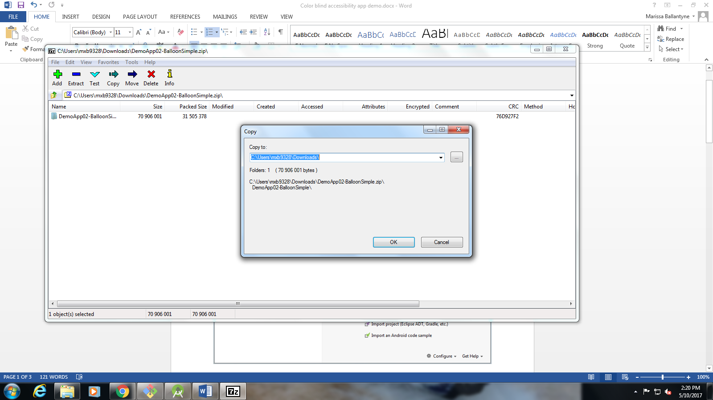
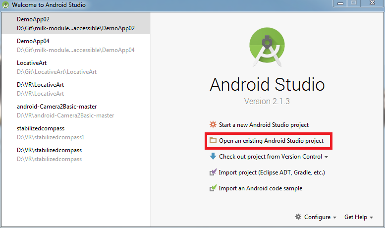
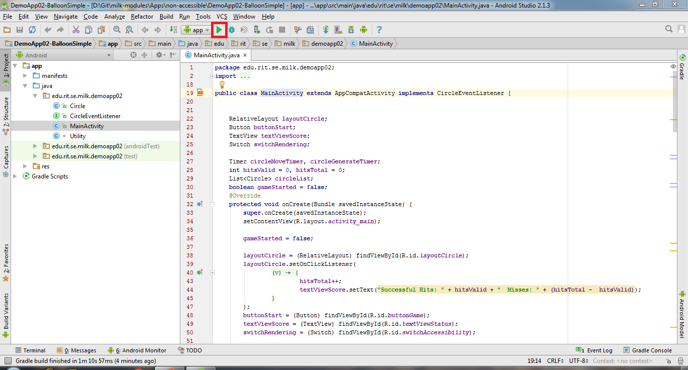
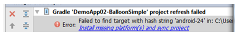

# Activity: Color Blind Safe Accessibility (Simple)

### Prerequisite

1. Install Android Studio. Follow [these](https://docs.google.com/document/d/10YFPoM6By201u5EgzJMfNjy7U11QNmVsFjB9XiOD5lY/edit) instructions. (It will take a few minutes to install.)

2. Download the code from: http://bit.ly/2q3pxgt

   You can also view the code on GitHub here: <https://github.com/milk-modules/Apps/tree/master/non-accessible/DemoApp02-BalloonSimple>

### Steps

1. Extract the zip file into a directory on the C: drive:

   

   ​

2. Import project in to Android studio

   Open Android studio.

   Import project in Android studio

   Open the directory you unzipped  the activity into. 

   

   ​

3. Run the project using the emulator

   

   ​

4. Once the emulator starts up, select  the “balloon game” app on the Apps screen. You will be able to see an app that is non-accessible to color-blind users.

   

5. To fix this follow the following steps:
   Open Circle.java file
   On line 32, paste the following code


```java
if(isPoppable) {
    Paint paint = new Paint();
    paint.setColor(Color.rgb(0,0,0));
    paint.setTextSize(64f);
    paint.setAntiAlias(true);
    paint.setTextAlign(Paint.Align.CENTER);

    canvas.drawText("+", x, y + circleRadius / 2, paint);
}
```


6. Run the project again and see the difference

   

   ​

#### Troubleshooting

When you first open the project, you may be unable to run it because of this error:



Click on the blue text and select “Accept” and then “Install” on the popup
