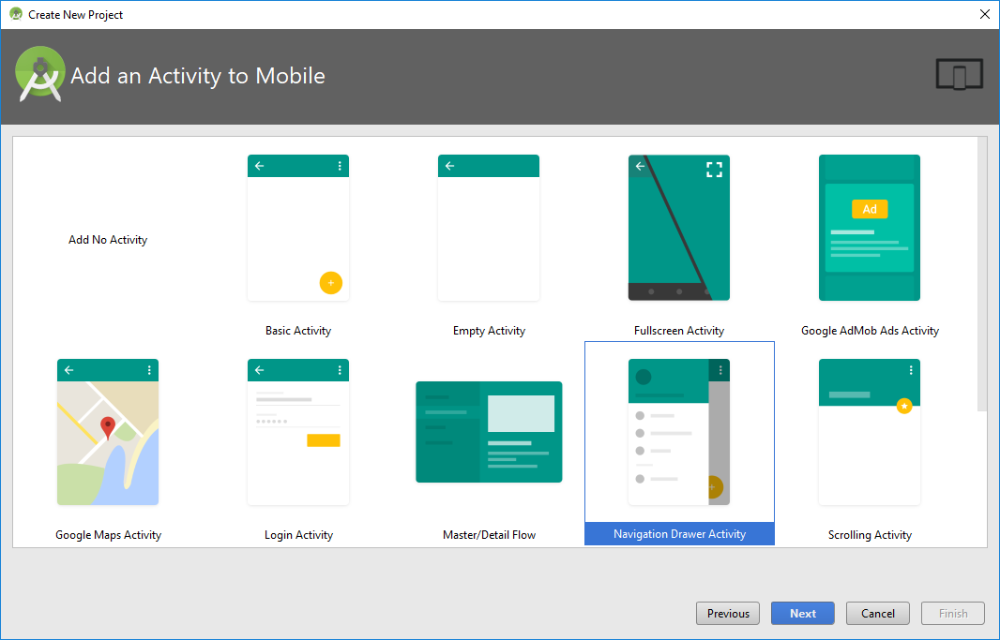
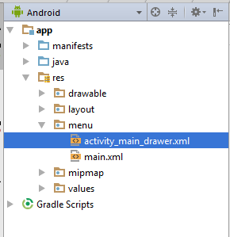
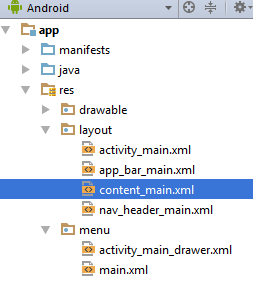
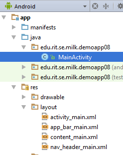

# Activity: Navigation

### Background

Navigating within an app can be challenging for users if the developer utilizes a custom navigation approach. Android Studio includes a project template that provides developers with the ability to build apps that utilize a persistent "navigation drawer". This UI element provides developers with the ability to present a standard navigation mechanism for user to navigate within the app. This module introduces the Navigation Drawer and how it can be utilized in an app.

A working version of this app is available at: https://github.com/milk-modules/Apps/tree/master/accessible/DemoApp08


### Prerequisite

1. Android Studio is installed on the development workstation
2. A working Android emulator is available for testing

### Steps
The following steps provide end-to-end instructions on building a simple app that utilizes the Navigation Drawer.

#### Part 1 - Project Creation

1. Start Android Studio and select the option to create a new project.

2.    Except for the “Add an Activity to Mobile”screen, accept the defaults in the project creation wizard.

3.    In the “Add an Activity to Mobile” screen select“Navigation Drawer Activity”

   

   #### Part 2 - Project UI Customization

   1. Replace the content of the file *activity_main_drawer.xml* with the following:.

   

   ```xml
   <?xml version="1.0" encoding="utf-8"?>
   <menu xmlns:android="http://schemas.android.com/apk/res/android">

       <group android:checkableBehavior="single">
           <item
               android:id="@+id/nav_breaking"
               android:icon="@drawable/ic_menu_breaking"
               android:title="Breaking News" />
           <item
               android:id="@+id/nav_world"
               android:icon="@drawable/ic_menu_world"
               android:title="World" />
           <item
               android:id="@+id/nav_local"
               android:icon="@drawable/ic_menu_local"
               android:title="Local" />
           <item
               android:id="@+id/nav_sports"
               android:icon="@drawable/ic_menu_sport"
               android:title="Sports" />
       </group>

       <item android:title="Communicate">
           <menu>
               <item
                   android:id="@+id/nav_share"
                   android:icon="@drawable/ic_menu_share"
                   android:title="Share" />
               <item
                   android:id="@+id/nav_send"
                   android:icon="@drawable/ic_menu_send"
                   android:title="Send" />
           </menu>
       </item>

   </menu>
   ```

   2. Replace the content of the file *content_main.xml* with the following:

   

   ```xml
   <?xml version="1.0" encoding="utf-8"?>
   <RelativeLayout xmlns:android="http://schemas.android.com/apk/res/android"
       xmlns:app="http://schemas.android.com/apk/res-auto"
       xmlns:tools="http://schemas.android.com/tools"
       android:layout_width="match_parent"
       android:layout_height="match_parent"
       app:layout_behavior="@string/appbar_scrolling_view_behavior"
       tools:context="edu.rit.se.milk.demoapp08.MainActivity"
       tools:showIn="@layout/app_bar_main">

       <TextView
           android:id="@+id/textView2"
           android:layout_width="match_parent"
           android:layout_height="wrap_content"
           android:text="TextView"
           android:textAlignment="center"
           android:textStyle="bold" />

       <ListView
           android:id="@+id/listview"
           android:layout_width="368dp"
           android:layout_height="495dp"
           tools:layout_editor_absoluteX="8dp"
           tools:layout_editor_absoluteY="8dp"
           android:layout_centerHorizontal="true"
           android:layout_below="@+id/textView2" />
   </RelativeLayout>
   ```

   #### Part 3 - Code Updates

   1. Replace the content of *MainActivity.java* with the following:

   

   ```java
   package edu.rit.se.milk.demoapp08;

   import android.os.Bundle;
   import android.support.design.widget.FloatingActionButton;
   import android.support.design.widget.Snackbar;
   import android.view.View;
   import android.support.design.widget.NavigationView;
   import android.support.v4.view.GravityCompat;
   import android.support.v4.widget.DrawerLayout;
   import android.support.v7.app.ActionBarDrawerToggle;
   import android.support.v7.app.AppCompatActivity;
   import android.support.v7.widget.Toolbar;
   import android.view.Menu;
   import android.view.MenuItem;
   import android.widget.ArrayAdapter;
   import android.widget.ListView;
   import android.widget.TextView;
   import android.widget.Toast;

   public class MainActivity extends AppCompatActivity
           implements NavigationView.OnNavigationItemSelectedListener {

       String[] newsItems;
       NavigationView navigationView;
       TextView newsType;

       @Override
       protected void onCreate(Bundle savedInstanceState) {
           super.onCreate(savedInstanceState);
           setContentView(R.layout.activity_main);
           Toolbar toolbar = (Toolbar) findViewById(R.id.toolbar);
           setSupportActionBar(toolbar);


           DrawerLayout drawer = (DrawerLayout) findViewById(R.id.drawer_layout);
           ActionBarDrawerToggle toggle = new ActionBarDrawerToggle(
                   this, drawer, toolbar, R.string.navigation_drawer_open, R.string.navigation_drawer_close);
           drawer.setDrawerListener(toggle);
           toggle.syncState();

           newsType = (TextView) findViewById(R.id.textView2);

           navigationView = (NavigationView) findViewById(R.id.nav_view);
           navigationView.setNavigationItemSelectedListener(this);

           navigationView.getMenu().getItem(0).setChecked(true);
           onNavigationItemSelected(navigationView.getMenu().getItem(0));
       }

       @Override
       public void onBackPressed() {
           DrawerLayout drawer = (DrawerLayout) findViewById(R.id.drawer_layout);
           if (drawer.isDrawerOpen(GravityCompat.START)) {
               drawer.closeDrawer(GravityCompat.START);
           } else {
               super.onBackPressed();
           }
       }

       @Override
       public boolean onCreateOptionsMenu(Menu menu) {
           // Inflate the menu; this adds items to the action bar if it is present.
           getMenuInflater().inflate(R.menu.main, menu);
           return true;
       }

       @Override
       public boolean onOptionsItemSelected(MenuItem item) {
           // Handle action bar item clicks here. The action bar will
           // automatically handle clicks on the Home/Up button, so long
           // as you specify a parent activity in AndroidManifest.xml.
           int id = item.getItemId();

           //noinspection SimplifiableIfStatement
           if (id == R.id.action_settings) {
               return true;
           }

           return super.onOptionsItemSelected(item);
       }

       @SuppressWarnings("StatementWithEmptyBody")
       @Override
       public boolean onNavigationItemSelected(MenuItem item) {
           // Handle navigation view item clicks here.
           int id = item.getItemId();

           if (id == R.id.nav_breaking) {
               Toast.makeText(this,"Breaking News!", Toast.LENGTH_SHORT).show();
               newsType.setText("Breaking News");
               newsItems = new String[]{
                       "Breaking News 01",
                       "Breaking News 02",
                       "Breaking News 03",
                       "Breaking News 04",
                       "Breaking News 05",
                       "Breaking News 06",
                       "Breaking News 07",
                       "Breaking News 08",
                       "Breaking News 09",
                       "Breaking News 10",
                       "Breaking News 11",
                       "Breaking News 12"
               };
           } else if (id == R.id.nav_local) {
               Toast.makeText(this,"Local News!", Toast.LENGTH_SHORT).show();
               newsType.setText("Local News");
               newsItems = new String[]{
                       "Local News 01",
                       "Local News 02",
                       "Local News 03",
                       "Local News 04",
                       "Local News 05",
                       "Local News 06",
                       "Local News 07",
                       "Local News 08",
                       "Local News 09",
                       "Local News 10",
                       "Local News 11",
                       "Local News 12"
               };
           } else if (id == R.id.nav_world) {
               Toast.makeText(this,"World News!", Toast.LENGTH_SHORT).show();
               newsType.setText("World News");
               newsItems = new String[]{
                       "World News 01",
                       "World News 02",
                       "World News 03",
                       "World News 04",
                       "World News 05",
                       "World News 06",
                       "World News 07",
                       "World News 08",
                       "World News 09",
                       "World News 10",
                       "World News 11",
                       "World News 12"
               };
           } else if (id == R.id.nav_sports) {
               Toast.makeText(this,"Sports News!", Toast.LENGTH_SHORT).show();
               newsType.setText("Sports News");
               newsItems = new String[]{
                       "Sports News 01",
                       "Sports News 02",
                       "Sports News 03",
                       "Sports News 04",
                       "Sports News 05",
                       "Sports News 06",
                       "Sports News 07",
                       "Sports News 08",
                       "Sports News 09",
                       "Sports News 10",
                       "Sports News 11",
                       "Sports News 12"
               };
           } else if (id == R.id.nav_share) {
               Toast.makeText(this,"Share", Toast.LENGTH_SHORT).show();
           } else if (id == R.id.nav_send) {
               Toast.makeText(this,"Send!", Toast.LENGTH_SHORT).show();
           }

           ArrayAdapter<String> adapter = new ArrayAdapter<>(this, android.R.layout.simple_list_item_1, newsItems);
           ListView listView = (ListView) findViewById(R.id.listview);
           listView.setAdapter(adapter);

           DrawerLayout drawer = (DrawerLayout) findViewById(R.id.drawer_layout);
           drawer.closeDrawer(GravityCompat.START);

           return true;
       }
   }
   ```

   ​

   Deploy the app into the emulator. Tap the icon () on the top left of the app, to show the menu. Tapping a menu item will change the content shown on the screen.


### Explanation

The following section will provide a brief explanation for some of the above steps 

- Step #3 – Instead of creating the Navigation Drawer from scratch, Android provides a project template containing the NavigationDrawer
- Step #4 – Replace the existing menu items with new values
- Step #5 – Places a ListView control in the main content area of the app. The content of the ListView will be updated based the user’s menu selection
- Step #6 – Part of the code is part of the project template and is generated when the project is provisioned. The code is updated to render the content of the ListView based on the user’s menu selection. 